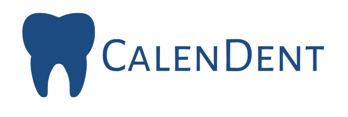

# CalenDent



## Introduction

Welcome to **CalenDent**, the ultimate Dental Clinic Reservation app designed to streamline the management of your dental clinic. Built using Flask, jQuery, HTML, and CSS, CalenDent offers an efficient and affordable solution for dentists to manage clinic information, pictures, and portfolios.

[Learn more about CalenDent](https://www.dentistomarashraf.tech/about)

## Features

- **Effortless Appointment Scheduling**: Easily manage patient appointments with an intuitive interface.
- **Comprehensive Clinic Management**: Maintain detailed records of patient information, treatment history, and clinic operations.
- **Portfolio Management**: Showcase before-and-after pictures of treatments to attract new patients.
- **Secure and Scalable**: Built with security best practices to ensure patient data is protected.

## Getting Started

Follow these simple steps to get CalenDent up and running on your local machine.

### Prerequisites

Make sure you have the following installed:

- Python 3.x
- Flask
- jQuery
- HTML/CSS

### Installation

This app is worked on WSL: Ubuntu-22.04:

Make Sure from :

	1 - install mysql 8.0.39-0ubuntu0.22.04.1 (Ubuntu)
	
	2 - install all dependancies on requirements.txt

Clone the repository:

```bash
	git clone https://github.com/DentistOmarAshraf/CalenDent.git
	pip3 install -r requirements.txt
	cat setup_mysql_dev.sql | sudo mysql
	./run_add_city_and_service.sh
	./run_web
	./run_api
```

### How to use:

After Succesful Installation you will find an Empty home page
on http://localhost:5000

start by signUp as A user (Doctor and Patient)
Add A clinic to Doctor user
Start a search by city and Neighborhood with Patient user
Enjoy !!

If there is any problem don't hesitate to contact me: omar_ashraf@live.com
This Application was made in only 2 week
it 's my first Web App ever, And I am very Proud of it
I am still working on It
Thank you
